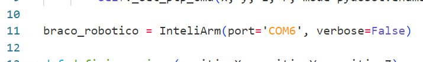

# Ponderada semana 7

Para executar o projeto, conecte o robô no computador e mude a porta no arquivo robot.py, na seguinte linha:

Em seguida, execute os seguintes comandos:

`$ python -m pip install -r requirements.txt`

`$ python app.py`

Para visualizar o vídeo demonstrativo, acesse o seguinte link:
https://drive.google.com/file/d/1W7LuTS3C1qKAPYP1Wc-MFu9bkmSlzF6l/view?usp=sharing
